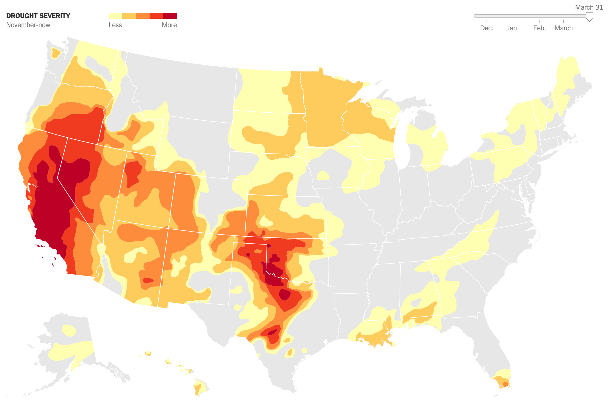
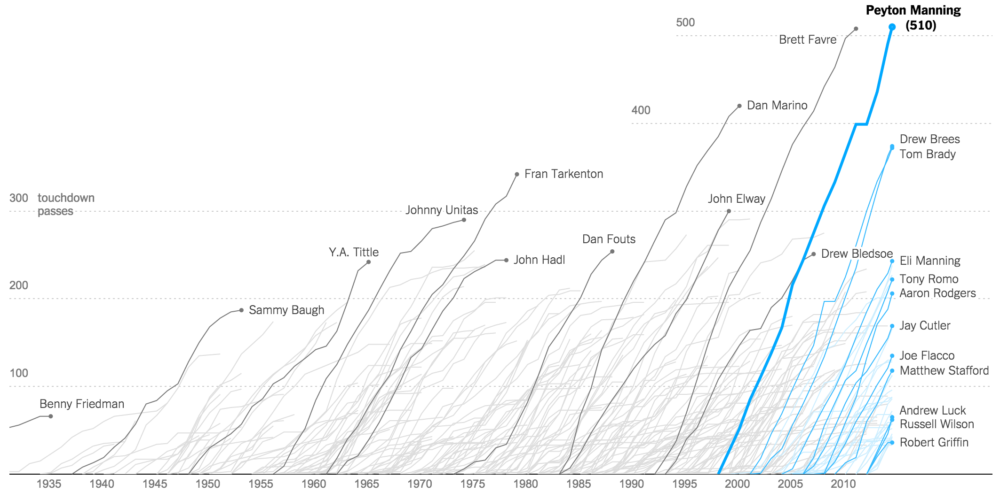

# Class 3: Understanding chart intent; Creating a blueprint for charting in D3; Improving on Excel

Today we'll do an exercise as a group, then become barley farmers.

## Housekeeping

* Review of last week
  * Learned about Anscombe Quartet
  * Built our first scatterplot
  * Learned how to push to Observable 
  * Send me your Observables! 

* Goals for this next classes:
 	* Explore charting & intent
 	* Come up with multiple ways to visualize a dataset
 	* Learn about hierarchical data & d3.nest()

## Quick activity -- charts and intent

Charts are all about deciding what information you want to communicate to your readers. Let's discuss the goals of these seven charts and decide on a headline for each based on what we think the author is trying to communicate.

**[Droughts](http://www.nytimes.com/interactive/2014/upshot/mapping-the-spread-of-drought-across-the-us.html)**

**[Middle-class comparisons](http://www.nytimes.com/2014/04/23/upshot/the-american-middle-class-is-no-longer-the-worlds-richest.html)**

**[Related](http://www.nytimes.com/newsgraphics/2013/09/28/eli-manning-milestone/) [Quarterbacks](http://www.nytimes.com/interactive/2014/10/19/upshot/peyton-manning-breaks-touchdown-passing-record.html)**

**General gameplan for sketching**
We'll find ourselves doing this over and over, so this might be helpful in the future.
 1. Navigate to your working directory, create an `index.html` file with D3 loaded and start a local server
 2. Load your data
 3. Add an SVG on the page.
 4. Format your data, adding fields as necessary
 5. Do your data join
 6. Position your elements 
 7. Add an axis
 8. Add styles
 9. Other customizations, "fiddly bits"

More at [blueprint.md](blueprint.md).

## Activity
Today, everyone is a barley farmer. Find out where you're a farmer on [this spreadsheet](https://docs.google.com/spreadsheets/d/17xOrBfaXxM_z1xrwNv-mZQokXnwqt-piGzpJDIAjv70/edit?usp=sharing).

As William S. Cleveland puts it in [Visualizing Data](https://books.google.com/books/about/Visualizing_Data.html?id=V-dQAAAAMAAJ):

 > In the early 1930s, agronomists in Minnesota ran a field trial to study the crop barley. At six sites in Minnesota, ten varieties of Barley were grown in each of two years. The data are the yields for all combinations of site, variety and year, so there are 6 x 10 x 2 =120 observations.

Find which city you're a barley farmer in (there are six sites, so lets break into groups of three). Find all the other members of the class with the same town as you and sketch a chart of whatever form you want. You can filter your data for just your site from [this tsv](barley.tsv).

The intent of the chart will be to **compare the yield for each variety of barley for that town in 1931 and in 1932** as effectively as possible. In your design, keep in mind another constraint: you would like to be able to view every other chart, along with yours, at once, to see if you can spot any differences between locations.

Your group should produce just one chart.

Once everyone has one, we'll put them up on the wall and discuss the merits of the form. Ideally, we'll also notice an anomaly in the data that researchers noticed in the 1930s, too.

Let's make a plan for the most effective way to display all these charts at once in the browser.  

## Lab
 1. We're going to chart whatever we decide as a class is the best way to present the data for *all* the sites. Stay in your groups. We'll start with one, but with the goal in mind of replicating it for all 6.
 2. As always, let's get started making a starter kit for this chart. Use the blueprint if you like.
 3. You don't have to do all the steps right now, but you should have an `index.html` page on a localhost, with the data loaded and formatted, and your `xScale` and `yScale` defined, with ranges, if not domains. 
 4. Do we need a new kind of scale? (Check out [scales.html](views/scales.html))
 5. Get your chart as close as possible to what your drawing looks like.

## Part II
 1. So far we haven't improved on Excel. Now let's abstract out our chart to make it work for any location. 
 2. Draw one chart for each location. Can you spot the anomaly?

## For overachievers
1. The way these are sorted can really improve their effectiveness. First, try to sort the sites by their median yield for all varieites in 1931 and 1932. Then, for each site, sort the varieties by their *overall* yield across all sites, in decreasing order. (Each site should have the same variety order.)
2. Functions are one way to do this, but a more effective way is probably using one of D3's most powerful methods: `d3.nest()`. If there's time, we'll explore creating all the charts at once with this method.

## Further reading
 * [Tidy data](http://www.jstatsoft.org/v59/i10/paper) By Hadley Wickham
 * Also, review [this code](https://bl.ocks.org/mbostock/0533f44f2cfabecc5e3a) for Thursday. 

## Extra Credit
 * [Arrays and nesting](https://github.com/mbostock/d3/wiki/Arrays#-nest)
 * [An older article by Mike about nesting](http://bost.ocks.org/mike/nest/)
 * [An extremely useful tool by Shan Carter](http://bl.ocks.org/shancarter/raw/4748131/)

