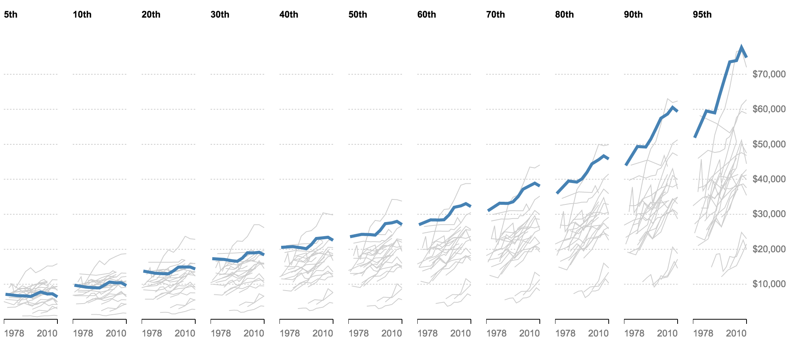

# Class 5: Line charts, working with nested data

## Housekeeping
  * Show + tell?
  * Useful API references:
    * [d3.nest](https://github.com/d3/d3-collection#nests) - a utility for nesting an array of data. Experiment with [Mister Nester](http://bl.ocks.org/shancarter/raw/4748131/).
    * [d3.line](https://github.com/d3/d3-shape#lines) - a utility we haven't explored yet for generating an [SVG path string](http://www.w3schools.com/svg/svg_path.asp).
  * Observable
    * Awesome for design
    * Great for comparing code
  * Goals for today
    * Improve skills with d3.nest()
    * Familiarize ourselves with line charts and the `path` and `line` SVG elements
    * Learn to recognize hierarchical data when we see it
    * Create and manipulate nested data
    * Work on the 'fiddly bits' of charts -- the last 10 percent

## Lab, Part I: Let's review the barley
Before we go through line charts, let's review the work that we did with the barley. I'd like to focus on how the data is structured like the visualization. 

## Line charts
Mostly we've worked with `circle` and `rect` elements, but the `path` element, which power line charts, is slightly different. First, about line charts:

* Strengths of line charts
  * A charting workhorse
  * Ideal for comparing relationships over time
  * Generally better than bar charts if you're comparing more than two series 

* Common mistakes
  * Legends when they are not necessary (dynamic labels can be a headache too though)
  * Dual Axes
  * 3D charts (except when it's not a mistake)

* Examples of NYT line charts, (not all made using D3):
  * [The Jobless Rate for People Like You](http://www.nytimes.com/interactive/2009/11/06/business/economy/unemployment-lines.html) 
  * [Recovering, But at Different Paces](http://www.nytimes.com/interactive/2012/11/27/us/recovering-but-at-different-paces.html?ref=us)
  * [Case Shiller Home Prices Interactive](http://www.nytimes.com/interactive/2014/01/23/business/case-shiller-slider.html)
  * [Why Peyton Manning’s Record Will Be Hard to Beat](http://www.nytimes.com/interactive/2014/10/19/upshot/peyton-manning-breaks-touchdown-passing-record.html)
  * [How Likely is it that Birth Control Could Let You Down?](http://www.nytimes.com/interactive/2014/09/14/sunday-review/unplanned-pregnancies.html)
  * [American Middle Class is No Longer the World’s Richest](http://www.nytimes.com/2014/04/23/upshot/the-american-middle-class-is-no-longer-the-worlds-richest.html?abt=0002&abg=0)

## About SVG paths and lines
Let's take a look at [the documentation](https://www.w3schools.com/graphics/svg_path.asp) for paths and [lines](https://www.w3schools.com/graphics/svg_line.asp)

## Lab, part II
The Upshot launched with a large story using a study by the Luxembourg Income Study (LIS) that included cross-country comparisons for a variety of income levels in a handful of countries. The Times focused on comparing middle-class incomes, publishing a front-page story titled [The American Middle Class Is No Longer the World’s Richest](http://www.nytimes.com/2014/04/23/upshot/the-american-middle-class-is-no-longer-the-worlds-richest.html?abt=0002&abg=0). We’ll work with [the data used in that story](http://www.lisdatacenter.org/resources/other-databases/) today. 

Open up the data in a spreadsheet of your choice and spend a few minutes getting to know what the fields represent. It's messy!

Our first goal will be to **make a line chart of the middle class income for the U.S.** using the PPP positional measure (tab 3). Specifically, take a look at `Cut-off points (cop): Equivalized (PPP), 2005 PPP dollars`, the data set in the "middle" of that sheet. Think about how you would need to format or restructure this data. 

For this, and all today's exercises, we'll work with [incomes.csv](views/incomes.csv), a slightly cleaned up version of that spreadsheet.

We'll make four charts of increasing complexity today.

Here's our first goal:


* Recall our checklist from week 3 and the d3 margin conventions we always like to borrow.
  * Navigate to your working directory, create an `index.html` file with D3 loaded and start a local server
  * Load your data
  * Add an SVG on the page.
  * Format your data, adding fields as necessary
  * Do your data join
  * Position your elements 
  * Add an axis
  * Add styles
  * Other customizations, "fiddly bits"
* Next, make the same chart, but instead we want to include all the other countries as a reference. Let's use d3.nest()!
* Our goal is something like this. Think about what elements you would need to make that.


* The chart we just made isn't helpful if we care about knowing which countries are which. Your nested data does not need to change, but you will need to restructure your code to make a chart for each country. Let's say we want to compare middle-class incomes of the U.S. to the following countries:

  ```
  var compareCountries = ["United Kingdom", "Norway", "Germany", "Canada", "Netherlands", "France", "Sweden", "Ireland", "Spain"]
  ```

  Here's our goal – note the sort here isn't particularly meaningful -- and how would we maybe change that, by the way?:
  


* Finally, a look forward to next class: a comparison of the full distribution at each income level, highlighting the US in each. 

  

  If you have time, try to get it closer to this. It gets complicated quickly!

  

  It's just one line to make this more simplified version, if you prefer:

  


## Thoughts for Next Week

#### Mobile
Designing a visualization that works for both mobile and desktop is hard. Take a look at these examples that I think do a great job. *Note how to view on Mobile with Chrome developer tools*

  - [A 3-D View of a Chart That Predicts The Economic Future: The Yield Curve](http://www.nytimes.com/interactive/2015/03/19/upshot/3d-yield-curve-economic-growth.html)
  - [The Facebook Offering: How It Compares](http://www.nytimes.com/interactive/2012/05/17/business/dealbook/how-the-facebook-offering-compares.html)
  - [Fewer Helmets, More Deaths](http://www.nytimes.com/interactive/2014/03/31/science/motorcycle-helmet-laws.html)
  - [The Tenure Pipeline at Harvard Business School](http://www.nytimes.com/2013/09/08/education/harvard-case-study-gender-equity.html?ref=education)

#### Next Level Stuff
Read through [this code](https://bl.ocks.org/mbostock/34f08d5e11952a80609169b7917d4172) and try to understand what each piece does. It's not a simple visualization, so try to get it running locally and try commenting out section to see what it does. 
