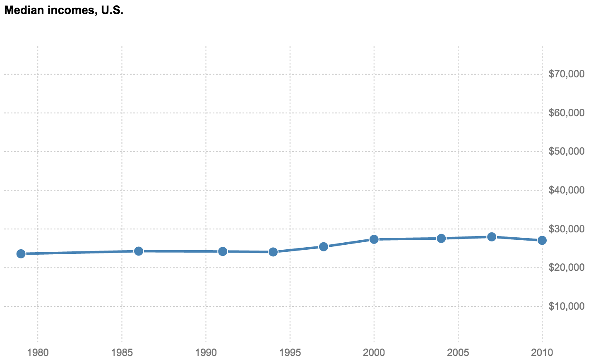

# Class 6: More nested data and a group charting exercise

## Housekeeping
 
* Any questions?
* Future Classes - Some Ideas:
  * [Network Graphs](http://bl.ocks.org/mbostock/4062045)
  * [Chord Layouts](https://bl.ocks.org/mbostock/4062006)
  * [Radial Layouts](http://bl.ocks.org/mbostock/1044242)
  * [Treemap](https://bl.ocks.org/mbostock/4063582)
    * Recent [NY Times](https://www.nytimes.com/interactive/2017/02/27/us/politics/most-important-problem-gallup-polling-question.html?smid=pl-share) example
  * Preprocessing and baking with Node and D3

* Goals for today
  * Review line chart from Monday
  * Work on making one of two more complex NYT income line charts
  * The challenge of polish: first 90% and last 10%, mobile, fiddly bits

## Finding Answers -- Isolate Your Problem

* Stack overflow
    * Copy and paste error messages
    * Use the console!
        * Did your data load correctly?
        * Check elements 
        * is your line generator the problem?
        * $0.__data__
        * Style section
        * Make variables global (if nec.)
* Finding examples
  * [bl.ocks](http://bl.ocks.org/)
  * [blocksplorer](http://bl.ocksplorer.org/)
  * Look for simple examples by good authors 
  * Neat little trick:

  ```
    d3.selectAll("circle").each(function(d) { return console.log(JSON.stringify(d)) })
  ```
* Using the API
  * Recognize Javascript vs D3 
* Testing locally 
  * Commenting (usually Command + /)
* Recognize differences in data structures
  * CSV, TSV, JSON
  * Nested JSON, Hierarchical Data
  * Drawing the structure can help

## Line Chart from Monday

Let's take a look at what we made on Monday, going through each section. Then we'll work on creating this nested charts, two ways, of varying complexity. 

First, make sure you have something in this ballpark.


Then see if you can get to this:


And then this:


If you're feeling bold:
* make the lines two colors, based on whether a country increased or decreased its income over the time period

## For Next Tuesday

* 

