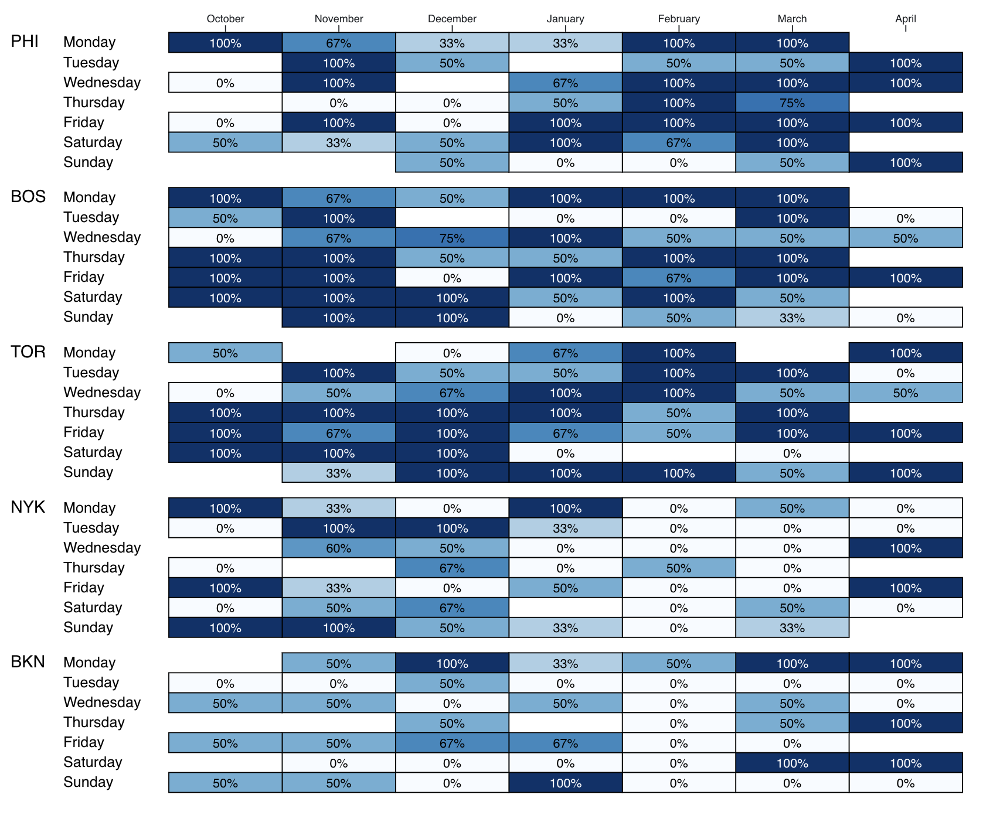

# Class 8: Building confidence with hierarchical data, data joins, and updates, responsive charts, interactivity

## Housekeeping
* Any questions?
* Any show and tell?
* Goals for today
  * Let's review what we've learned throughout the course by making a heatmap in D3
* Let's vote!
  * [Network Graphs](https://beta.observablehq.com/@mbostock/d3-force-directed-graph)
  * [Treemaps](https://beta.observablehq.com/@mbostock/d3-treemap)
  * [Stacked Bar Charts](https://beta.observablehq.com/@mbostock/d3-stacked-bar-chart)
  * [Heatmaps](https://beta.observablehq.com/@leoyuholo/hong-kong-temperature-heatmap)
  * [Pie Charts / Donut Charts](https://beta.observablehq.com/@mbostock/d3-pie-chart)
  * [Bubble Charts](https://beta.observablehq.com/@mbostock/d3-bubble-chart)
  * [Sankey Diagrams](https://beta.observablehq.com/@mbostock/d3-sankey-diagram)
  * [Simple Scrollytelling](https://pudding.cool/2017/03/comeback/) (this might have to be a two session walk through.. we'll see)

## Lab, Part 1
Today we'll be working with basketball data, called [nba.csv](views/nba.csv). I got it from this [Kaggle Project](https://www.kaggle.com/michaelmcfarlane/20172018-nba-regular-season-game-data/version/1). Download it and take a look. You might also benefit from a lookup table called [lookup.tsv](views/lookup.tsv). Some basic info about the data (if you don't know much about basketball):

 * There are 30 teams.
 * Each team has 82 games a season.
 * The season starts in October and ends in April (playoffs start after)
 * Not all teams play the same day of week.
 * Some games are back-to-back, meaning there are two games two days in a row.
 * No one ever has three games three days in a row.
 * A field goal is when someone makes a basket.
 * Attempts and makes are ways of evaluating shooting efficiency.
 * Most field goals are two points. Those that are not are called three point shots. They are shot from a line that's far from the basket.
 * Assist is when someone recieves a sweet pass before they make a field goal
 * Steal is when you take the ball from the opposing team.
 * Block is when you block a shot from the opposing team.
 * Turnover is when you lose the ball and the other team gets it.
 * Personal fouls is when the ref says NOPE.
 * Rebounds is when you grab the ball after a missed field goal. If you get it when you're on defense, it's a defensive rebound. If you get it when you're on offense, it's an offensive rebound.

We're going to make this chart:



As always, let's make checklist for what we need to make this chart, and lets think about how we want to format the data. Also, let's walk through:
  * Updating the results by division
  * Div hover-over objects

One other thing - we're going to load in multiple datasets. Now this is a new process as part of d3 v5. We can read about the changes (here)[https://github.com/d3/d3/blob/master/CHANGES.md].
```
async function loadData() {

const data = await d3.csv("file.csv");
const dataTwo = await d3.csv("fileTwo.csv");

// Then we do the rest of our chart
}

```
The result is something much more similar to observable.

## Lab, Obesrvable Time
Ok, now that we've done this locally, check out the Observable notebook I made for it. I want you to fork it, and get it to work by -> 
  * Just month for each team
  * Get a dropdown to select different metrics to use for the fill color and text
  * Make a scatterplot to compare two metrics to see how they correlate

